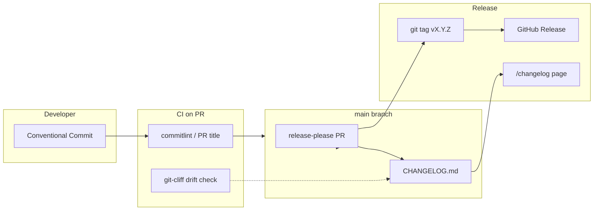

# Keprix Reference 163: Changelog automation architecture

## Purpose

Reference map for moving Keprix from **manual Keep a Changelog** edits to **automated
entries from Conventional Commits**, without breaking:

- Marketing `/changelog` (`frontend/src/lib/changelog.ts`)
- MkDocs `docs/reference/changelog.md`
- GitHub Releases (`.github/workflows/release.yml`)

Read first: `docs/operations/changelog-automation.md`.

## Current state (shipped 2026-07-06)

- Manual `CHANGELOG.md` with `## [Unreleased]`.
- `scripts/check-changelog-sync.sh` in CI.
- `generate_doc_pages.py --only changelog` for docs copy.
- Marketing page ISR `revalidate = 300`.
- Release workflow extracts changelog section on `v*.*.*` tag.

## Target state



## Tool boundaries

### git-cliff

- Config: `cliff.toml` at repo root.
- Output format: Keep a Changelog (must match `parseChangelog()` regexes).
- **Writer role (choose one)**:
  - **Option A (recommended with release-please)**: preview + CI validation only.
  - **Option B**: auto-commit Unreleased on push to main (conflicts with release-please; do not combine).

### release-please

- Config: `release-please-config.json` + `.release-please-manifest.json`.
- Creates PR titled `chore(main): release X.Y.Z` with version bumps and changelog.
- On merge: tag + GitHub Release (can replace custom `release.yml` changelog step).

### Parser contract (`frontend/src/lib/changelog.ts`)

Automation must preserve these patterns:

```text
## [Unreleased]
## [1.2.3] - 2026-07-06
### Added
### Changed
### Fixed
- bullet item
```

Invalid headings break the marketing timeline.

## Prompt series

| # | File | Delivers |
| --- | --- | --- |
| 164 | `164-changelog-auto-01-conventional-commits-enforcement.md` | commitlint, PR title action, docs |
| 165 | `165-changelog-auto-02-git-cliff-generation.md` | cliff.toml, preview script, CI drift |
| 166 | `166-changelog-auto-03-release-please-workflow.md` | release PRs, tag flow, release.yml merge |

## Files touched (expected)

| Path | Prompt |
| --- | --- |
| `commitlint.config.js` | 164 |
| `.github/workflows/commitlint.yml` or extend `ci.yml` | 164 |
| `cliff.toml` | 165 |
| `scripts/changelog-preview.sh` | 165 |
| `tests/scripts/test_changelog_parser.py` (extend) | 165 |
| `release-please-config.json` | 166 |
| `.github/workflows/release-please.yml` | 166 |
| `.github/workflows/release.yml` | 166 (simplify or retire changelog awk) |
| `CONTRIBUTING.md`, `docs/community/contributing.md` | 164, 166 |
| `RELEASE_CHECKLIST.md` | 166 |

## Non-goals

- Auto-generating marketing copy beyond changelog bullets.
- Replacing `CHANGELOG.md` with GitHub Releases API at runtime.
- Monorepo multi-package versioning (single `keprix` package only for v1).

## Working directory

```text
/opt/lampp/htdocs/verlox/keprix/
```
