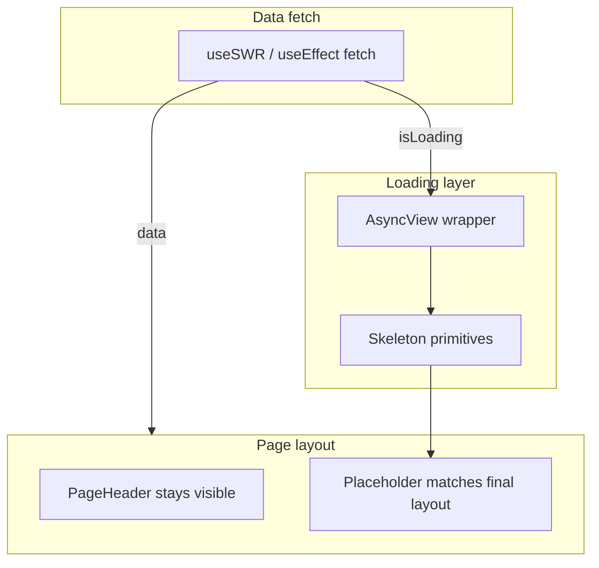

# Keprix Reference 167: Skeleton loading architecture

## Purpose

Reference map for making **slow API loads feel intentional** across Keprix workspace,
admin, and settings surfaces. Users can tolerate latency when the UI preserves layout and
shows shape-accurate placeholders instead of blank screens, centered spinners, or
`Loading...` text.

Read first after ship: `docs/frontend/loading-states.md` and
`/opt/lampp/htdocs/verlox/UI.UX/patterns/skeleton-loading-states.md`.

Depends on Prompt **22** (design system: every component must have a loading state).

## Current state (audit 2026-07-06)

Keprix loading UX is **inconsistent**:

| Pattern | Where used | Problem |
| --- | --- | --- |
| MUI `Skeleton` (ad hoc) | Admin dashboard, usage charts, developer portal, notifications | Good shape, but no shared primitives; heights hard-coded per file |
| `CircularProgress` | `DataTable`, chat, playbook, email, research, compare | Loses layout; user sees empty center |
| Plain text (`Loading tasks...`) | Tasks, billing, calendar, governance, personas, `RecordDetail` | No structure; feels broken on slow networks |
| Button label swap (`Scanning...`) | Playbook, forms | OK for actions; not for page data |

Rough counts in `frontend/src`:

- ~21 files import `@mui/material/Skeleton`
- ~11 files use `CircularProgress` for data fetches
- ~25+ surfaces use `Loading ...` typography

### Pages that already skeleton (keep, then normalize to primitives)

- `(admin)/dashboard/page.tsx` and child widgets (`StatCard`, `AgentActivity`, etc.)
- `(workspace)/usage/page.tsx` and `components/usage/*`
- `(workspace)/notifications/page.tsx`
- `(workspace)/developer/page.tsx`, `developer/sdk/page.tsx`
- `(admin)/dashboard/usage/page.tsx`

### High-priority gaps (no skeleton today)

**Workspace data pages**

- `tasks/page.tsx`, `notes/page.tsx`, `documents/page.tsx`, `contacts/page.tsx`
- `vault/page.tsx`, `calendar/page.tsx`, `email/page.tsx`
- `memory/page.tsx`, `skills/page.tsx`, `gallery/page.tsx`
- `opportunities/[id]/page.tsx`, `research/page.tsx`, `analytics/page.tsx`

**Settings and billing**

- `settings/billing/page.tsx`, `components/billing/*`
- `settings/governance/page.tsx`, `settings/users/page.tsx`
- `settings/web-search/page.tsx`, localization settings pages

**Shared UI components (used everywhere)**

- `components/ui/DataTable.tsx` (spinner today)
- `components/ui/RecordDetail.tsx` (text today)
- `components/ui/Timeline.tsx`, `CitationList.tsx`, `ToolRunTrace.tsx`

**Chat**

- `chat/page.tsx` uses spinner + wordmark (acceptable for session bootstrap; optional
  skeleton sidebar in a later pass)

## Target state



### Decision rules

| Situation | Use | Avoid |
| --- | --- | --- |
| List or table of records | `SkeletonTable` / `SkeletonList` | Centered `CircularProgress` |
| Stat cards or dashboard grid | `SkeletonStatGrid` | Single large skeleton block |
| Chart or wide panel | `SkeletonChart` | Text `Loading chart...` |
| Detail pane (master-detail) | `SkeletonDetailPanel` | `Loading record...` text only |
| Full page first paint | Layout skeleton under `PageHeader` | Full-page spinner |
| Form submit / one-shot action | Button disabled + label (`Saving...`) | Page skeleton |
| Chat message streaming | Existing stream indicators | Skeleton per token |
| `prefers-reduced-motion: reduce` | Static skeleton (no pulse) | Forced wave animation |

**Principle:** Skeletons mirror **final component geometry** (row count, card height, chart
aspect). Slow loads are fine; **layout shift** is not.

### Theme and motion

- Use MUI `Skeleton` with `variant="rounded"` and `animation="wave"` by default.
- Read `prefers-reduced-motion` and set `animation={false}` when reduced.
- Border radius: match `DashboardCard` / `Paper` (`theme.shape.borderRadius` or 8px).
- Do not introduce new colors; use `theme.palette.action.hover` / default skeleton tokens.

### API patterns

**SWR (preferred for read-heavy pages):**

```tsx
const { data, isLoading, error } = useSWR("tasks", fetchTasks);
return (
  <AsyncView loading={isLoading} error={error} skeleton={<SkeletonList rows={5} />}>
    <TaskList tasks={data} />
  </AsyncView>
);
```

**useEffect + useState:** pass `loading` into the same primitives; do not fork patterns.

### Out of scope (this series)

- Marketing site loading (SSR/ISR; separate concern)
- Backend response caching or API performance
- Chat token streaming UI
- Mobile native shells (document mapping only in UI.UX pattern doc)

## Implementation prompts

| Prompt | Title |
| --- | --- |
| **168** | Shared skeleton primitives + `AsyncView` + shared UI component upgrades |
| **169** | Workspace route migration (tasks, contacts, vault, billing, settings, etc.) |
| **170** | Admin normalization, contract tests, docs, CI guard |

Build order: **168 -> 169 -> 170**.

## Parser / contract note

No backend changes. Frontend-only. Prompt **170** adds a lightweight UI contract test
that fails if known pages regress to `Loading ...` text or bare `CircularProgress` for
primary content areas.

## Related files

- `frontend/src/components/ui/DataTable.tsx`
- `frontend/src/components/admin/StatCard.tsx` (reference pattern)
- `frontend/src/app/(workspace)/notifications/page.tsx` (list skeleton reference)
- `planning/prompts/prompts-archive/22-unified-ui-ux-design-system-and-app-shell.md`
- `planning/prompts/prompts-archive/118-admin-dashboard-with-flexy.md`
- `planning/prompts/prompts-archive/137-admin-workspace-pages.md`
