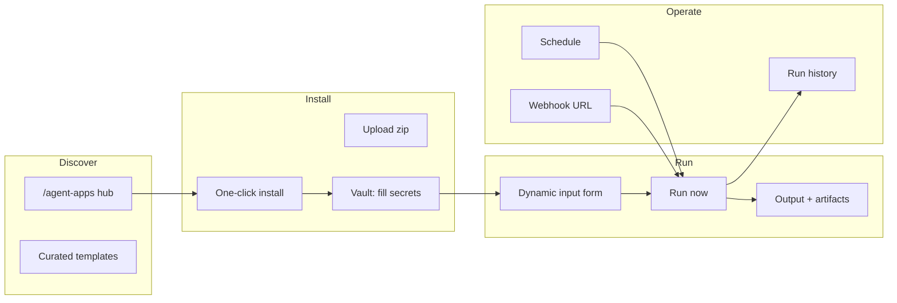

# Keprix Prompt 177: Agent Apps Product - Architecture Reference

**Status:** Reference document. Architecture foundation implemented 2026-07-06. Do not archive.

---

## Product vision (sellable, not minimal)

**Agent Apps** are installable, manifest-driven mini-products inside Keprix: a researcher,
operator, or small team should go from **discover -> install -> configure -> run -> schedule ->
share** without touching YAML, CLI, or API docs.

Prompt **67** shipped the engine (`agent_apps/`, CLI, basic `/agent-apps` page, hello-agent sample).
Prompts **178-186** turn that into a **commercial workspace feature** comparable to "apps on
your agent platform" (ADK / Volt / Mastra deploy patterns), integrated with billing, vault,
cron, evals, and agent-runtime.

### Primary personas

| Persona | Job to be done | Success metric |
| --- | --- | --- |
| **Researcher / analyst** | Run a packaged survey or report workflow weekly | Installs template, runs once in under 60s |
| **Ops / admin** | Schedule digest apps, audit runs | Cron + trace history without SSH |
| **Builder / consultant** | Ship a repeatable app to clients | Publish bundle, client imports one-click |
| **Developer** | Extend with Python + optional LLM | `keprix agent-app create`, CI eval gate |

### Non-goals

- Do not build a second agent OS parallel to `agent_apps/` (see reference-agent-feature-deduplication).
- Do not embed a full IDE; link to `/agent-studio` for multi-agent graphs.
- Do not require CLI for any operator-facing happy path.

---

## Current state (Prompt 67 baseline)

| Area | Shipped | Gap |
| --- | --- | --- |
| Manifest | `agent.yaml`, validation, tools/playbooks/evals refs | No input schema, icons, categories, pricing tier |
| Registry | `~/.keprix/agent_apps/installed.json` | No versions, updates, uninstall API |
| Runners | local, web, api, scheduled (Python entrypoint only) | No LLM bridge; hello-agent is trivial Python |
| UI | `/agent-apps` list + hardcoded `hello-agent` runner | No app picker, install UI, detail page |
| Traces | In-memory `_global_traces` | Lost on restart; not in `/agent-runtime` |
| Evals | `POST /{app}/evals` | No UI; not gated on publish |
| Bundle | zip export | No marketplace import, no hub |
| Billing | `agent_apps.enabled` flag in control-center docs | Not enforced on routes |
| Docs | agent-studio.md one-liner | No operator guide |

Key paths:

```text
src/keprix/agent_apps/
frontend/src/app/(workspace)/agent-apps/
frontend/src/lib/agent-apps-api.ts
tests/agent_apps/
```

---

## Target experience (frictionless)



### Golden path (60 seconds)

1. User opens `/agent-apps` -> sees **Recommended for you** cards (Daily Standup, Research Brief).
2. Clicks **Install** on "Daily Standup" -> vault prompts only if `required_env` missing.
3. Lands on app **detail** with plain-language description and one text area ("What should I focus on?").
4. Clicks **Run** -> sees answer + optional download (markdown/PDF link if app returns artifact).
5. Optional: **Run every Monday 9am** toggle creates cron job linked to app.

---

## Architecture layers

### 1. Manifest v2 (`agent.yaml`)

Extend manifest (backward compatible with v1):

```yaml
name: daily-standup
version: 1.2.0
display_name: Daily Standup
description: Summarises open tasks and recent email into standup bullets.
category: productivity
icon: standup
entrypoint: agents.main:run
runtime: agent          # python | agent | hybrid
inputs:
  - id: focus
    label: What should I focus on?
    type: text
    required: false
outputs:
  - id: markdown
    type: markdown
required_env: [KEPRIX_DEFAULT_PROVIDER]
required_permissions: [network, email_read]
tools:
  - tools/tasks.yaml
playbooks: []
eval_suite: evals/basic.yaml
schedule:
  suggested: "0 9 * * 1-5"
  timezone: user
billing:
  tier: pro
  meter: runs_per_month
```

`runtime: agent` invokes Keprix agent loop with `instructions.md` + declared tools/skills.
`runtime: python` keeps current entrypoint-only behavior.

### 2. Registry v2

SQLite or JSON under `~/.keprix/agent_apps/`:

- `installed.json` rows: name, version, path, installed_at, source (template|upload|hub|studio)
- `runs.db`: trace_id, app, input_hash, status, started_at, duration_ms, artifact_paths
- Version check + `upgrade` + `uninstall` (remove dir + cron unlink)

### 3. Execution bridge

New module `agent_apps/agent_runtime.py`:

- Builds `AgentRunContext` from manifest (instructions, tools, skills, vault env)
- Calls existing agent loop (`keprix.agent` or chat pipeline) with approval gates
- Emits lifecycle events to persistent store
- Returns structured `output` + `artifacts[]`

Do not fork a new LLM client; reuse configured provider from `.env` / settings.

### 4. Marketplace / templates

```text
src/keprix/agent_apps/catalog/
  index.json
  daily-standup/
  research-brief/
  invoice-review/
domain-packs/*/agent-apps/   # optional cross-link
```

API:

- `GET /api/agent-apps/catalog` - browse templates
- `POST /api/agent-apps/catalog/{id}/install` - copy to registry

### 5. Scheduling and automation

- Link to `/admin/cron`: job payload references `app_name` + frozen input JSON
- `POST /api/agent-apps/{name}/schedule` - create/update linked cron job
- `POST /api/agent-apps/{name}/webhook` - rotate URL token; maps to api runner
- Public route: `POST /api/public/agent-apps/{token}/run` (optional, gated by plan)

### 6. Billing and entitlements

Extend `config/billing.yaml` (or equivalent):

```yaml
feature_flags:
  agent_apps.enabled: true
  agent_apps.marketplace: true
  agent_apps.scheduled: false   # pro+
  agent_apps.publish: false     # team+
  agent_apps.max_installed: 3
  agent_apps.max_runs_per_month: 100
```

Enforce via `require_feature` on install, run, schedule, publish routes.
Surface upgrade CTA in UI (pattern from `/settings/billing`).

### 7. UI routes

| Route | Purpose |
| --- | --- |
| `/agent-apps` | Hub: installed + catalog tabs, search, categories |
| `/agent-apps/[slug]` | Detail: configure, run, history, schedule, evals |
| `/agent-apps/install` | Upload zip or pick folder path (admin) |
| `/developer/agent-apps` | API keys, webhook docs (link from developer portal) |

Wire navigation in `frontend/src/lib/navigation.ts` under **Automations** or **Build**.

### 8. Integrations (do not duplicate)

| System | Integration |
| --- | --- |
| `/agent-studio` | Export published graph as `agent.yaml` + bundle |
| `/agent-runtime` | Filter runs by `source=agent_app` |
| `/evals` | App eval suites in unified eval dashboard |
| `/admin/cron` | Show linked app name on cron jobs |
| `/vault` | Resolve `required_env` before run |
| `/domain-packs` | Pack may ship `agent-apps/*` subfolder |
| Control center | `agent_apps.enabled` toggle |

---

## Build order (prompts 178-186)

| # | Prompt | Delivers |
| --- | --- | --- |
| 178 | Frictionless hub UI | Replace minimal page; app picker; detail route shell |
| 179 | Manifest v2 + dynamic forms | Input schema, categories, validation |
| 180 | Agent execution bridge | LLM runtime, tools, instructions.md |
| 181 | Install lifecycle | Upload zip, uninstall, upgrade, registry v2 |
| 182 | Marketplace catalog | Curated sellable templates (3+) |
| 183 | Schedule + webhooks + public API | Cron link, webhook tokens |
| 184 | Billing + entitlements | Feature gates, usage meter, upgrade UX |
| 185 | Observability + evals UI | Persistent traces, history, eval dashboard |
| 186 | Docs + scaffold + e2e | Operator guide, `agent-app create`, verification |

Parallel OK: **179** after **178**; **180** after **179**; **181** can start after **178**;
**182** after **181**; **183** after **180**; **184** after **183**; **185** after **180**;
**186** last.

---

## Sellable packaging (go-to-market)

### Included in Pro (example positioning)

- Install up to 10 apps from marketplace
- 500 agent-app runs/month
- Schedule up to 5 apps
- Run history 30 days

### Team / Enterprise add-ons

- Publish private apps to org library
- Webhook + API access per app
- Custom app onboarding (upload branded bundle)
- SSO audit export of app runs

Copy and exact limits are implemented in prompt **184**; marketing page links from `/pricing`.

---

## Testing strategy

- Unit: manifest v2 validation, registry, execution bridge mocks
- API: install/run/schedule/billing 402 paths
- Frontend: Playwright or Vitest for golden path install+run
- Eval: `evals/suites/agent-apps/basics.yaml`
- Agent brief: `prompts-archive/186-agent-apps-golden-path-verification.md` (prompt 186)

---

## Reference files to read before building

```text
planning/prompts/prompts-archive/67-google-adk-style-agent-lifecycle-and-workflow-app.md
src/keprix/agent_apps/
frontend/src/app/(workspace)/agent-apps/
src/keprix/billing/feature_gates/
frontend/src/app/(workspace)/admin/cron/
frontend/src/app/(workspace)/builder/    # template card UX pattern
docs/integrations/sdk.md                 # defineAgentApp future alignment
```
