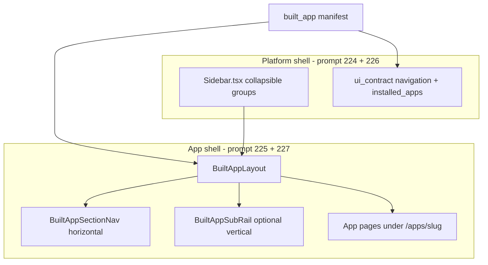

# Keprix - Prompt 223: Built Apps Navigation Architecture Reference

## Purpose

Reference and dependency map for **two-layer navigation** in the workspace web UI:

1. **Platform shell (left pane):** Keprix OS nav; collapsible groups; one launcher entry per installed built app.
2. **App shell (content area):** Product-owned inner menus (Carina / ABBIS style) inside `/apps/[slug]/*`.

Build prompts **224-228** completed 2026-07-09. **Do not archive this file.**

Operator doc: `docs/features/built-apps-navigation.md`.

---

## Problem

The workspace sidebar (`frontend/src/components/shell/Sidebar.tsx`) already lists **8 groups** and **~40 items** from `src/keprix/ui_contract/navigation.py`. Built products (eng ABBIS, CompassLab, future verticals) need **5-20 routes each** with their own IA, branding, and role-based sections.

Putting every app submodule in the global sidebar:

- Pollutes the Keprix OS mental model
- Creates merge conflicts in `navigation.py` per app team
- Does not scale past 2-3 installed products

Carina and ABBIS reference patterns keep **platform nav thin** and put **module nav inside the content column**.

---

## Design principles

| Principle | Rule |
| --- | --- |
| **OS vs product** | Left pane answers "where am I in Keprix?"; content area answers "where am I in this app?" |
| **One global entry per app** | Sidebar shows `ABBIS` once, not Members / Finance / Rigs as top-level items |
| **App owns inner IA** | Horizontal section bar, inner sub-rail, or tabs live in `BuiltAppLayout` |
| **Progressive disclosure** | Platform groups collapse by default except Workspace (+ active app group when applicable) |
| **Manifest-driven** | Installed built apps register via manifest; no hardcoded ABBIS routes in core |
| **Boundary** | Keprix core ships shell primitives + sample app; AbbiS product code stays in `apps-on-keprix/` |

---

## Target layout

### Platform mode (browsing Keprix)

```text
+-- Left pane (260px) ----------+-- Content (AppShell main) -----+
| Keprix logo                   | TopBar                        |
| v Workspace        [expanded]   | PageHeader + page             |
|   Chat, Documents, ...        |                               |
| > Apps             [collapsed]  |                               |
| > Research         [collapsed]  |                               |
| v Installed apps   [expanded]   |                               |
|   ABBIS  --> /apps/abbis        |                               |
| > Admin            [collapsed]  |                               |
+-------------------------------+-------------------------------+
```

### Built app mode (`/apps/abbis/*`)

```text
+-- Left pane ------------------+-- Built app content shell -----+
| (same platform sidebar)       | BuiltAppHeader                 |
| Installed apps > ABBIS active | [Members | Finance | Rigs ...] |  <- inner section nav
|                               | page content                   |
+-------------------------------+-------------------------------+
```

Platform sidebar **stays visible** so Chat, Launcher, and Settings remain one click away.

---

## Navigation layers



---

## Manifest schema (v1)

File: `built_app.yaml` (or `app.manifest.yaml`) beside the app frontend bundle.

```yaml
id: abbis
label: ABBIS
description: Borehole drillers association operations
entry: /apps/abbis
icon: building
version: 1.0.0
brand:
  primary_color: "#1a4d2e"   # optional; MUI theme override inside app shell only
navigation:
  style: sections            # sections | sub_rail | tabs_only
  items:
    - id: dashboard
      label: Dashboard
      href: /apps/abbis
      icon: dashboard
    - id: members
      label: Members
      href: /apps/abbis/members
      icon: users
    - id: finance
      label: Finance
      href: /apps/abbis/finance
      icon: payments
```

**Global sidebar:** only `entry` + `label` + `icon` from manifest. **`navigation.items`** render inside `BuiltAppLayout`, not in `NAV_ITEMS`.

---

## Route convention

| Pattern | Owner |
| --- | --- |
| `/launcher`, `/chat`, `/settings`, ... | Keprix platform pages (`AppShell`) |
| `/agent-apps/*` | Agent Apps product (existing; unchanged) |
| `/apps/[slug]/*` | Built app host layout + app-owned pages |

Workspace layout (`frontend/src/app/(workspace)/layout.tsx`):

- `/chat/*` keeps `ChatWorkspaceShell` (no change)
- `/apps/[slug]/*` uses `AppShell` + `BuiltAppLayout` from slug layout
- All other routes use `AppShell` as today

---

## UI contract extension (prompt 226)

Add to `build_ui_contract()`:

```python
"installed_apps": [
  {"id": "abbis", "label": "ABBIS", "href": "/apps/abbis", "icon": "building"},
],
```

Merge into sidebar rendering as group **`installed_apps`** (label: "Installed apps"), placed after **Apps**, before **Research**.

Role gating: reuse manifest `roles` list when present; default visible to all authenticated users.

---

## Component kit (prompt 225)

| Component | Role |
| --- | --- |
| `BuiltAppLayout` | Root wrapper: header + optional section nav + children |
| `BuiltAppHeader` | Title, description, breadcrumbs, back link, actions slot |
| `BuiltAppSectionNav` | Horizontal MUI `Tabs` or `ToggleButtonGroup` for `navigation.items` |
| `BuiltAppSubRail` | Optional 220px column inside main for deep modules |
| `useBuiltAppNav(slug)` | Load manifest nav for active slug (SWR + static fallback for sample) |

Reuse existing `PageHeader` patterns where possible; do not fork MUI theme globally.

---

## Collapsible platform groups (prompt 224)

| Behavior | Detail |
| --- | --- |
| Toggle | Click group overline to expand/collapse |
| Persist | `localStorage` key `keprix_nav_group_{groupId}` |
| Default | `workspace` expanded; `installed_apps` expanded when route under `/apps/*`; others collapsed |
| Active route | Auto-expand group containing current `pathname` |
| a11y | `aria-expanded` on group headers; keyboard Enter/Space toggles |

Reference: admin sidebar collapse in `frontend/src/components/admin/Sidebar.tsx` (icon rail is out of scope for 224; optional future prompt).

---

## Inner nav patterns (when to use which)

| Pattern | Use when | Example |
| --- | --- | --- |
| **Horizontal sections** | 4-8 peer modules | ABBIS admin bar |
| **Sub-rail** | Deep ERP with nested areas | Members > list / import / roles |
| **Tabs only** | Views of one entity | Member detail: Profile / Dues / History |
| **Breadcrumbs only** | Shallow hierarchy | Settings sub-pages |

Apps may combine: sections at layout level + tabs inside a page.

---

## Relationship to Agent Apps

| | Agent Apps (`/agent-apps`) | Built apps (`/apps/[slug]`) |
| --- | --- | --- |
| Purpose | Runnable manifest workflows, forms, cron | Full product UI hosted in workspace |
| Nav | Hub cards; no deep IA in sidebar | Inner section nav in content area |
| Engine | `agent_apps/` runners | Next.js pages + optional Keprix API |
| Overlap | An app may expose both a built UI and an agent workflow | Document in app README |

Do not merge registries in v1; built apps registry is separate (`built_apps/`).

---

## Sample and first consumer

| Deliverable | Location |
| --- | --- |
| In-repo sample | `examples/built-app-starter/` + `/apps/starter` routes (prompt 227) |
| AbbiS eng product | `verlox/apps-on-keprix/abbis/` adopts 225-227 after core ships (out of Keprix core prompts) |

---

## Build order

See `prompts-archive/ref-223-built-apps-navigation-build-order.md`.

```text
223 Architecture reference (this file)
224 Collapsible platform sidebar groups
225 BuiltAppLayout component kit
226 Built apps registry + UI contract + launcher nav entry
227 /apps/[slug] route host + starter sample
228 Docs, tests, archive series
```

**224** and **225** can run in parallel after reading **223**. **226** before **227**. **228** last.

---

## Acceptance (reference doc)

- [x] Two-layer nav model documented
- [x] Manifest schema v1 defined
- [x] Route convention `/apps/[slug]/*` specified
- [x] Boundaries vs Agent Apps and AbbiS stated
- [x] Prompts 224-228 listed in `pending-prompts/README.md`
