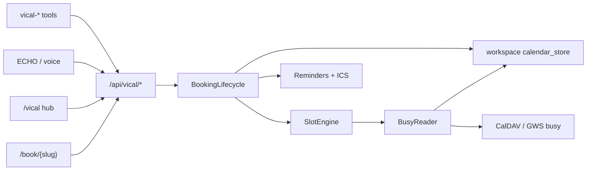

# Prompt 376 / 00: Overview and guardrails (adopt viCal into Keprix)

Status: COMPLETED 2026-08-04
Series: Keprix viCal booking adoption  
Depends on: none  
Blocks: 377-388  
Do not ask clarifying questions unless blocked by missing credentials or destructive ops.  
Writing style: plain ASCII only (no em/en dashes, no emoji).

## Why this exists

Propreneur viCal is a full booking product. Keprix already books appointments through workspace calendar + ECHO + optional GWS tools, but has no event-type catalogue, public guest funnel, intake, approval gates, or single free/busy authority. Adopting viCal behaviour without unifying those paths would create a third calendar.

## Goal

Port viCal **behaviour** into Keprix (Python Core + Next frontend) as one workspace-scoped booking engine, then make **ECHO, voice receptionist, agent tools, and `/calendar`** consume that engine so existing bookings stay coherent.

## Naming

| Surface | Convention |
|---|---|
| Product / UI | `viCal` |
| Host hub routes | `/vical` (and nav label viCal or Bookings) |
| Public guest | `/book/{slug}` |
| Internal package | `src/keprix/vical/` (or `vcal/`; pick one and stick to it) |
| Tables / store keys | `vcal_*` preferred for cross-product consistency |
| Feature flag | `KEPRIX_VICAL_ENABLED` (default on when module ships) |
| Billing (if ever gated) | Prefer Keprix entitlements later; do not invent Propreneur `booking_calendar` SKU copy without owner ask |

Suggested layout:

```
keprix/src/keprix/vical/
  types.py
  store.py / repository.py
  slots.py
  bookings.py
  availability.py
  calendar_bridge.py
  reminders.py
  routes.py
  tools.py
keprix/frontend/src/app/(workspace)/vical/...
keprix/frontend/src/app/book/[slug]/...
keprix/docs/features/vical.md
```

## Integration contract with existing Keprix booking

After prompts 01-04 and 07:

1. `EchoScheduler.find_available_slots` / `book_appointment` call viCal slot + booking services (default "Consultation" or workspace default event type), not invent fixed 09-17 windows alone.
2. Confirmed bookings always create/update a **workspace calendar event** via `workspace_repo` (existing path), so `/calendar` and CalDAV push keep working.
3. Store a durable link: `vcal_bookings.workspace_event_id` (or metadata) so cancel/reschedule stay bidirectional.
4. Agent tools (new `vical-*` plus optional aliases) do not bypass locks.
5. `gws_calendar_create` remains available for free-form agent creates; booking catalogue flows must go through viCal.
6. Voice / Aiva receptionist confirmation settings continue to gate destructive creates; they call the same lifecycle.

## Behavioural reference checklist (from propreneur-v2)

Phase in Must slices, not day one dump:

1. Event types (duration, buffers, min notice, horizon, location mode, approval flag, deposit flag).
2. Weekly availability rules + blackouts.
3. Slot generation minus bookings, buffers, blackouts, workspace busy, optional GWS/CalDAV busy.
4. Slot locks during book races.
5. Statuses: `pending_payment`, `pending_review`, `confirmed`, `cancelled`, `rejected`; outcomes `attended` / `no_show`.
6. Guest create + token cancel/reschedule; host approve/reject/cancel/reschedule.
7. Public `/book/{slug}`, embed.
8. Confirmations + ICS; reminders 24h / ~1h.
9. Conferencing adapters + calendar sync (reuse GWS / CalDAV first).
10. Lifecycle webhooks (`vical.booking.*` naming OK for product consistency).
11. Intake pools (later).
12. Stripe deposits using **existing** price IDs from `.access` only (owner gate).

## Technical guardrails

1. Port behaviour from propreneur-v2; rewrite in Python. Do not run Laravel inside Keprix.
2. Prefer Postgres when Keprix data-plane already uses it for workspace tables; otherwise extend the durable store pattern already used by `calendar_store.json` with a clear cutover note in 12. Do not invent a third persistence story without documenting migration.
3. Stripe: never create new prices unless the owner explicitly asks. Source of truth: `/opt/lampp/htdocs/verlox/.access/.stripe-credentials-and-price-id.md`. Never paste secret values into chat, logs, commits, docs, or UI.
4. Secrets stay in `.access/` and runtime env.
5. Writing style + No Stubs Rule per `1st-plan/1st-prompt/README.md`.
6. Tests: pytest unit + API feature tests for Must-haves every prompt.
7. Multi-user / workspace isolation must match calendar routes auth posture.
8. Do not drag Propreneur tenant models, CRM FKs, mentorship, or lodge bookings.

## Architecture target



## Out of scope for 00

Any code changes. Read this file + README, then start 01.

## Acceptance

- [ ] Implementing agent can state the integration contract in one paragraph without inventing a second slot engine.
- [ ] Proposed package path recorded in PR/docs when 01 starts.
