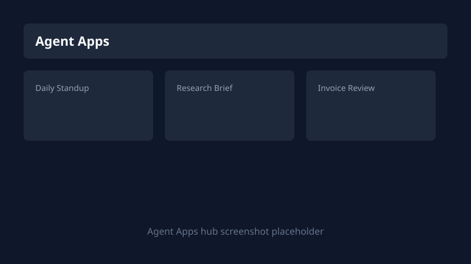

# Agent Apps

Agent Apps are **manifest-driven folders** that Keprix installs, runs, schedules, and meters as first-class products. Each app ships an `agent.yaml` manifest, optional tools and eval suites, and a web form generated from declared inputs.

Use Agent Apps when you want a **repeatable workflow** (standup, research brief, invoice review) with a fixed UI, billing limits, and exportable bundles. Use **chat** for ad-hoc questions and **Agent Studio** for multi-agent graphs and MCP workbench experiments.



## 60-second quick start

1. Sign in and open **Agent Apps** at `/agent-apps`.
2. Open the **Discover** tab and click **Install** on **Daily Standup**.
3. On the app detail page, check **Readiness** (set `KEPRIX_DEFAULT_PROVIDER` if needed).
4. Enter an optional focus note and click **Run**.
5. Open **Automate** and enable **Weekdays 9am** schedule (Pro plan).

## Installed apps

| Action | Where |
| --- | --- |
| Browse installed apps | `/agent-apps` **Installed** tab |
| Open app detail | Click a card or go to `/agent-apps/{name}` |
| Uninstall | Detail page **Manage** or `DELETE /api/agent-apps/{name}` |
| Export zip bundle | **Export** on detail or `GET /api/agent-apps/{name}/export` |
| Upload install | `/agent-apps/install` wizard or `POST /api/agent-apps/install/upload` |

The hub shows featured templates when you have two or fewer apps installed.

## Marketplace templates

Built-in templates live under `src/keprix/agent_apps/catalog/`:

| Template | Category | Tier |
| --- | --- | --- |
| Daily Standup | productivity | Free |
| Research Brief | research | Pro |
| Invoice Review | finance | Pro |

List templates:

```http
GET /api/agent-apps/catalog
```

Install:

```http
POST /api/agent-apps/catalog/daily-standup/install
```

Pro templates return **402 Payment Required** on Community plans with an upgrade link to `/pricing`.

## Inputs and outputs

Manifest v2 declares `inputs` and `outputs`. The web UI renders:

- `text`, `textarea`, `number`, `select`, `checkbox`, `date`
- Markdown and text output panels
- Artifact downloads when the runner returns file paths

Run payload:

```json
POST /api/agent-apps/daily-standup/run
{
  "inputs": { "focus": "Ship billing UI" },
  "runner": "web"
}
```

## Secrets and readiness

Apps declare `required_env` in `agent.yaml`. Values can come from:

- Instance `.env`
- **Vault** at `/vault`
- Provider config in **Settings**

Readiness check:

```http
GET /api/agent-apps/{name}/readiness
```

Returns `ready`, missing env keys, and permission notes before you run.

## Scheduling

On the app **Automate** tab:

- Cron presets (daily, weekdays, weekly)
- Timezone field
- Enable/disable toggle

Schedules create cron jobs visible at `/admin/cron` with `job_type: agent_app_run`. Pro plan and above required (`agent_apps.scheduled` feature flag).

## Webhooks and API

Rotate a webhook secret on the **Automate** tab, then call:

```bash
curl -X POST "http://127.0.0.1:3333/api/public/agent-apps/hooks/{token}" \
  -H "Content-Type: application/json" \
  -d '{"inputs": {"focus": "Webhook run"}}'
```

Authenticated run (API key from `/developer`):

```bash
curl -X POST "http://127.0.0.1:3333/api/agent-apps/daily-standup/run" \
  -H "Authorization: Bearer $KEPRIX_API_TOKEN" \
  -H "Content-Type: application/json" \
  -d '{"inputs": {"focus": "API run"}, "runner": "api"}'
```

Webhooks require Team plan (`agent_apps.webhooks`).

## Run history and evals

- **History** tab on the app detail page lists recent runs with status and duration.
- **Eval suite** runs bundled `evals/*.yaml` cases; trigger from UI or CLI.
- **Agent runtime** at `/agent-runtime` filters traces across apps.

Traces API:

```http
GET /api/agent-apps/{name}/traces
```

## Building your own app

### Folder layout

```text
my-app/
  agent.yaml          # manifest (required)
  instructions.md     # agent runtime instructions
  tools/              # tool manifests
  evals/basic.yaml    # eval cases
  agents/main.py      # python entrypoint (python runtime only)
```

### CLI scaffold

```bash
keprix agent-app create my-app --template agent
keprix agent-app create my-bot --template python ./my-bot
keprix agent-app validate ./my-app
keprix agent-app run ./my-app --input "Hello"
keprix agent-app bundle ./my-app -o my-app.zip
keprix agent-app catalog list
```

Install into the instance registry:

```bash
keprix agent-app install ./my-app
```

### Export from Agent Studio

Agent Studio (`/agent-studio`) builds multi-agent graphs. When you publish a portable bundle, export targets the same zip layout as **Export** on an installed app. See [Agent Studio](agent-studio.md).

## Billing limits

Configure limits in `config/agent_apps.yaml` and plan flags in `config/billing.yaml`.

| Plan | Max installed | Runs / month | Scheduling | Webhooks | Pro templates |
| --- | --- | --- | --- | --- | --- |
| Community | 3 | 50 | No | No | No |
| Pro | 10 | 500 | Yes (5 schedules) | No | Yes |
| Team | 50 | 5000 | Yes (25 schedules) | Yes | Yes |
| Enterprise | Unlimited | Unlimited | Yes | Yes | Yes |

Usage meter:

```http
GET /api/agent-apps/usage
```

Billing settings show an **Agent Apps usage** card at `/settings/billing`.

When a limit is exceeded, APIs return **402** with:

```json
{
  "detail": "agent_apps.max_runs_per_month",
  "message": "You have used 50 of 50 agent app runs this month.",
  "upgrade_url": "/pricing"
}
```

## Troubleshooting

| Symptom | Fix |
| --- | --- |
| Readiness red: LLM not configured | Set `KEPRIX_DEFAULT_PROVIDER` and provider API key in Settings |
| Missing env in readiness | Add keys to `.env` or Vault; names must match `required_env` |
| 402 on install or run | Check `/api/agent-apps/usage`; upgrade at `/pricing` |
| Pro template blocked | Community plan cannot install `tier: pro` catalog items |
| Webhook 401 | Rotate secret; use latest URL from Automate tab |
| Schedule not firing | Confirm job enabled at `/admin/cron` and plan includes `agent_apps.scheduled` |
| Agent Apps hidden | Admin disabled `agent_apps.enabled` in feature flags or governance policy |

## Configuration

| Variable | Purpose |
| --- | --- |
| `KEPRIX_AGENT_APPS_DIR` | Override installed apps directory |
| `KEPRIX_AGENT_APPS_CONFIG` | Path to `agent_apps.yaml` limits and features |
| `KEPRIX_AGENT_APP_RUN_RETENTION_DAYS` | Run history retention (default 30) |
| `KEPRIX_AGENT_APPS_ENABLED` | Set `false` to disable runner instance-wide |

## Related

- [Agent Studio](agent-studio.md)
- [Evals](evals.md)
- [Cron jobs](cron-jobs.md)
- [Developer platform](developer-platform.md)
- [Billing](billing.md)
- [REST API: agent apps](../reference/api.md)
